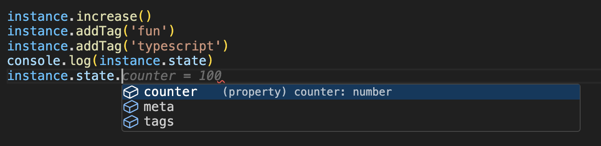

# 🚫 JS class rethink: Stop using Java/C#-like classes, use JS scope instead


Hey devs,

I want to introduce a new (but very old-school) way of defining "classes" in JavaScript/TypeScript.

It's called... wait for it... arrow functions with a mutable scope.
Say goodbye to class Foo and hello to just variables.

It's something between prototype-based JS functions and JS classes, with benefits from both worlds.

---

## 👶 Example: Basic Instance

```ts
const RethinkedClass = (constructorArgInitCounter?: number) => {
  // mutable variable
  let state = { counter: constructorArgInitCounter ?? 0 }
        
  // private state (pointer to privateState is not returned
  let privateState = { private: 'state' }

  // methods
  const increase = () => state.counter++

  // public facing API
  return { state, increase }
}

const instance1 = RethinkedClass(10)
const instance2 = RethinkedClass()
instance1.increase()
instance1.increase()
instance2.increase()
console.log(instance1.state.counter, instance2.state.counter) // 12, 1
```

You get two separate instances, each with its own internal `counter` and no `this` weirdness.

---

## 🧠 Type Inference Magic

One of the most powerful features of this functional approach is that **TypeScript understands the return types automatically**.  
You don’t have to write out complex class definitions, manually maintain `this` context, or even define interfaces unless you want to.

Let TypeScript infer everything for you — even for deeply nested structures.

```ts
const ComplexClass = (name: string) => {
  let state = {
    counter: 0,
    meta: {
      createdAt: new Date(),
      createdBy: name,
    },
    tags: ['tag1']
  }

  const increase = () => state.counter++
  const addTag = (tag: string) => state.tags.push(tag)

  return {
    state,
    increase,
    addTag,
    reset: () => {
      state.counter = 0
      state.tags = []
    }
  }
}

const instance = ComplexClass('devto_user')

instance.increase()
instance.addTag('fun')
instance.addTag('typescript')
console.log(instance.state)
// auto-completion works perfectly!
```



- No need to define types or interfaces — unless you want to.
- Full **autocomplete** and **type safety** in IDEs.
- Cleaner code, no boilerplate classes, constructors, or properties.
- TypeScript infers exact structure, including methods, nested objects, arrays, and types.
> This pattern **scales** — the more complex your internal state becomes, the more you benefit from automatic inference.

---

## 🧍‍♂️ Singleton Instance

```ts
const singletonRethinkedClass = (() => {
  let state = { counter: 0 }
  const increase = () => state.counter++
  return { state, increase }
})()

singletonRethinkedClass.increase()
singletonRethinkedClass.increase()
console.log(singletonRethinkedClass.state.counter) // prints 2
```

This pattern is also known as an IIFE – Immediately Invoked Function Expression.

No class, no new, no prototype, no `__proto__` just pure JS — scoped and stateful.

<!-- 
---

## 🧬 Inheritance via Spread Operator or just a object pointer

Want inheritance? Easy. Use just an function call and get a instance pointer

```ts
const ParentClass = (constructorArgInitCounter) => {
  const state = { counter: constructorArgInitCounter ?? 0 }
  const increase = () => state.counter++
  return { state, increase }
}

const ChildClass = () => {
  const parentClassInstance = ParentClass()

  const state = {
    parentState: parentClassInstance.state,
    childClassState: 0
  }

  const increase = () => {
    state.childClassState++
    parentClassInstance.increase()
  }

  return {
    state,
    increase,
  }
}

const childClass = ChildClass()
childClass.increase()
childClass.increase()
console.log(childClass.state.parentState.counter, childClass.state.childClassState) // prints 2, 2

```

No `super()`, no `extends`, just combine stuff like a LEGO set. -->

---

## 📐 Interfaces

Interfaces? just use satisfies instead

```ts
type SomeRandomClassInterface = {
  counter: number,
  increase: () => number
}

const MyClass = (constructorArgInitCounter?: number) => {
  const counter = constructorArgInitCounter ?? 1
  const increase = () => counter++
  return { counter, increase } satisfies SomeRandomClassInterface
}
```

Boom, typed with satisfaction 😎.

---

## problems with understanding  `.prototype.` or `__proto__`?

Nope. Nothing like that here. Just Function scopes and a few stable pointers on top of it.

---

## 😵‍💫 Binding `this`?

Ever had to `bind(this)` because `this` got lost in the callback wilderness?

```ts
class A {
  state = 0
  hello() {
    console.log(this.state)
  }
}
const aInstance = new A()
aInstance.state = 10
const helloPointer = aInstance.hello.bind(aInstance) // You need to do a bind this, or this code will no work at all
helloPointer() // print 10
```

Now compare with this scoped alternative:

```ts
const A = () => {
  const state = { counter: 0 }
  return {
    state,
    hello: () => {
      console.log(state.counter )
    }
  }
}
const aInstance = A()
aInstance.state.counter = 10
const helloPointer = aInstance.hello // works without bind!
helloPointer() // prints 10
```

Scoped closures never lose their context. That's the real magic.

---

## 🏗️ Class Builder

```ts
const classGenerator = (name: string) => {
  return (constructorArg) => {
    const state = { counter: 0, name }

    const increase = () => state.counter++

    return {
      state,
    }
  }
}
const MyClassA = classGenerator('a')
const MyClassB = classGenerator('b')

const a = MyClassA()
const b = MyClassB()
console.log(a.state.name) // prints a
console.log(b.state.name) // prints b

```

Currying, composition, and encapsulation with just functions. No decorators. No private fields. Just JS.

---

## ✅ Benefits

1. **Type inference** works perfectly – it's just a function.
2. No `this` pain or need for `.bind()`/`.call()`.
4. **Inheritance** is literal – just spread or compose.

---

## 🧨 Possible downsides?

- you need to wrap basic values like boolean/number/string to an object to get an pointer instead of copying values
- You're creating a lot of instances of functions (methods) in a memory, but no one care in the classical app development
- You can't use `instanceof` easily – but that's OK if you're doing type-driven development.

---

Give it a try, refactor one class, and feel the freedom of just writing functions.  
Classes are just sugar, and you don’t need that in your coffee ☕.

---

Let me know what you think or share your own scoped-class trick in the comments 👇

---

## 🧰 Bonus: Context Builder with AsyncLocalStorage

Let’s finish strong with a **real-world pattern** using this functional style — a generic `AsyncLocalStorage` context builder.

Instead of OOP-style context managers, we use a simple **higher-order function** with full type inference:

```ts
import { AsyncLocalStorage } from 'node:async_hooks'

export const genericAsyncLocalStorageContextBuilder = <InitState, T>(
  stateFn: (initState: InitState) => T
) => {
  const storage = new AsyncLocalStorage<T>()

  return {
    provideContext: (initState: InitState, callback: () => Promise<void> | void) => {
      const contextValue = stateFn(initState)
      return storage.run(contextValue, callback)
    },
    useContext: () => {
      const store = storage.getStore()
      if (!store) {
        throw new Error('❌ No context available. Make sure to use .run() before accessing the context.')
      }
      return store
    },
  }
}
```

### ✅ How to use it

```ts

const loggerContext = genericAsyncLocalStorageContextBuilder(() => {
  const state = { 
    counter: 0
  }

  return {
    state,
    increase: () => state.counter++
  }
})
```

---

## 🧲 Bonus #2: Reference Serializer with Internal WeakMap

Need to track object references and assign them unique serializable IDs?  
Here's a clean, testable, and zero-boilerplate way to do it — again, **no class needed**.

```ts
const serializeRef = (() => {
  const referenceMap = new WeakMap<object | ((...args: unknown[]) => unknown), number>()
  let counter = 0

  const get = (obj: object | ((...args: unknown[]) => unknown)) => {
    // You can add type guards here if needed
    if (!referenceMap.has(obj)) {
      referenceMap.set(obj, counter++)
    }
    return referenceMap.get(obj)!
  }

  return {
    get,
  }
})()
```

### ✅ How to use it

```ts
const refSerializer = buildSerializeRef()

const objA = {}
const objB = {}

console.log(refSerializer.get(objA)) // 0
console.log(refSerializer.get(objB)) // 1
console.log(refSerializer.get(objA)) // 0 (same as before)
```

This utility:
- Uses a **closure** for state (`referenceMap`, `counter`)
- Exposes a simple, focused API (`get`)
- Avoids global side effects
- Is easily mockable & testable
- Is perfect for serialization, diffing, or memoization

